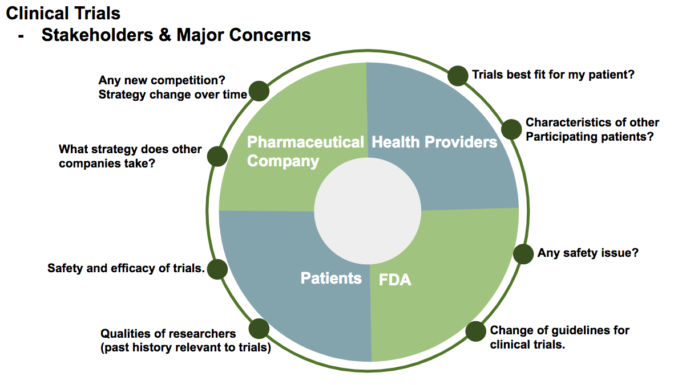
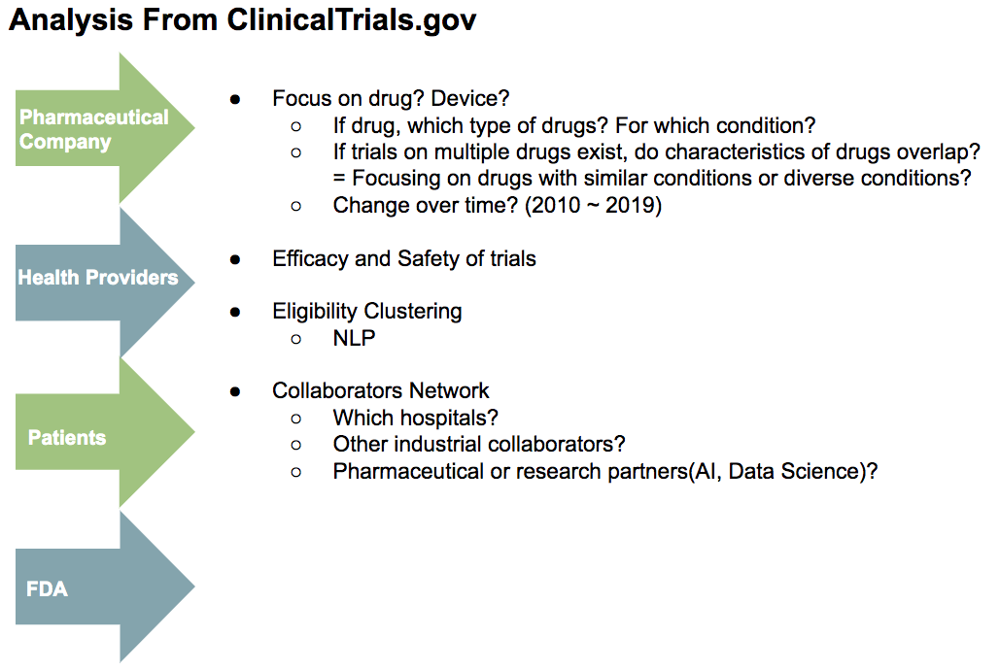
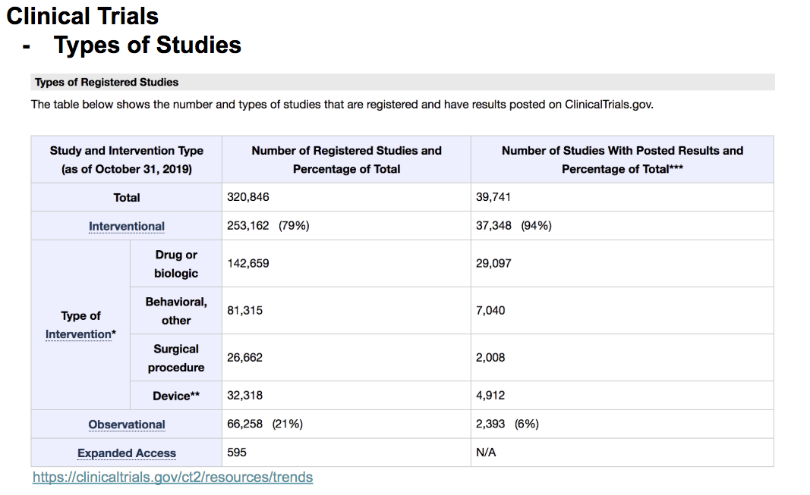
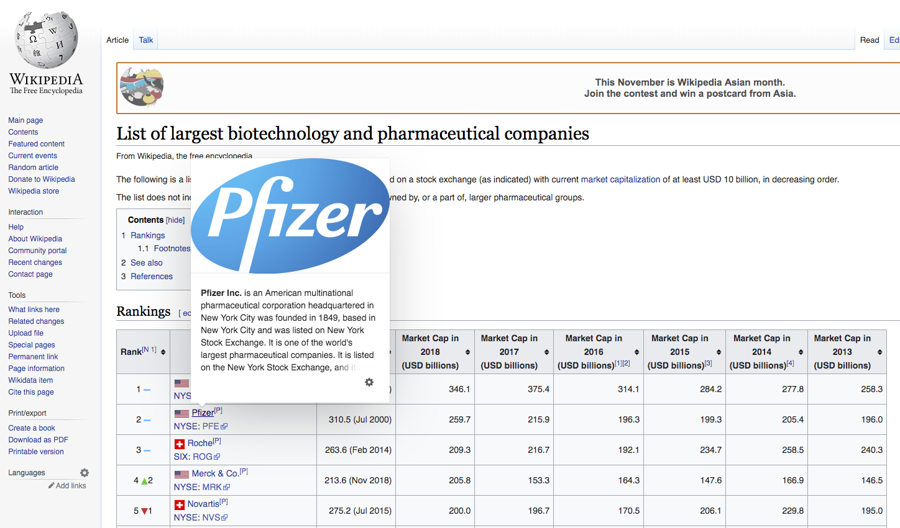

### Project Proposal

**Extracting industrial strategies of clinical trials.** 

**Purpose**: Analyzing the clinical trial dataset to gain an understanding of the strategies of major pharmaceutical companies on new drug or intervention developments.  

[Figure 1] Stakeholders of Clinical Trials  

**Background**: As Shown in [figure 1], Clinical trials involve many stakeholders from pharmaceutical companies to candidate participants. From an industrial perspective, a new product such as a drug or device can strengthen the company’s sales. As more advanced technologies get involved in the product development process, different strategies or collaborators are engaged for faster and efficient operation.

Starting from evaluating the change of strategies of different characteristics of companies investing in clinical trials, the project proposes to expand the analysis to concerns of more stakeholders.  

**Analysis Tools**: If provided, it is useful to utilize existing tools for faster analysis. There are multiple publications analyzing clinical trial data.
(1)EXACT from BioNLP of Univ. Massa

**Datasets**:  

(1) Clinical trials - download xml : clinicaltrials.gov
As shown in [figure 3], there are over 320, 846 trial records in clinicaltrials.gov.

(2) Pharmaceutical companies - require crawling : https://en.wikipedia.org/wiki/List_of_largest_biotechnology_and_pharmaceutical_companies

(3) MeSH API -require API calls to retreive information of MeSH Terms(Condition, Product Names) : https://id.nlm.nih.gov/mesh/swagger/ui#/lookup/lookupTerms  

3.1) API GET "https://id.nlm.nih.gov/mesh/lookup/descriptor?label=multiple%20myeloma&match=exact&limit=10  

3.2) Craw https://id.nlm.nih.gov/mesh/D009101.html for information

**Additional References**:

[1] Fanshawe, Thomas R., and Rafael Perera. "Automatic extraction of quantitative data from ClinicalTrials. gov to conduct meta-analyses." *BMJ evidence-based medicine*(2019): bmjebm-2019.